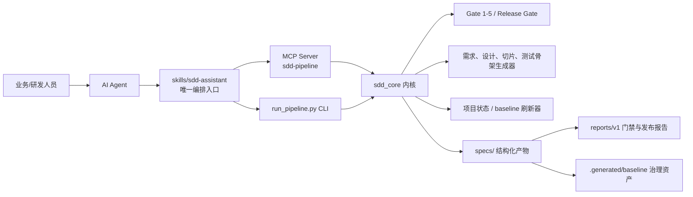

# sdd-assistant

- 项目名称：SDD Skill Asset Library / SDD Agent-Native Pipeline

## 0. 摘要

本项目面向 AI 辅助研发中的“需求、设计、实现、验证、发布”全链路治理，建设了一套以 SDD（Specification / Schema-Driven Development）为核心的方法论工具链。项目将架构设计能力沉淀为标准化 AI Skill，并通过物理门禁、结构化产物、可追溯报告和多 Agent 适配能力，约束 AI Agent 从“一句话需求”安全推进到“可验证交付”。

当前项目已经完成核心 MVP：形成 `sdd_core` 内核、`skills/sdd-assistant` 编排入口、MCP Server、CLI 流水线、门禁报告、设计包模板、baseline 治理资产与试点 feature。试点功能 `auth_login` 已进入 `release-ready`，Gate 1/2/3/4/5、Implementation、Release Gate 均为 `PASS`，并完成 5 条需求到设计、切片、测试骨架、发布治理的闭环映射。

## 1. 项目背景与设计初衷

### 1.1 背景

AI Agent 已经可以快速生成需求分析、技术方案和代码，但在企业研发场景中，仅有“生成能力”不够。实际落地时，经常出现以下问题：

- 需求没有结构化 ID，后续设计和测试无法证明覆盖完整。
- 设计文档与代码实现脱节，Agent 容易绕过已有架构边界直接编码。
- 评审依赖人工经验，缺少可重复执行的工程门禁。
- 多 Agent 平台各自一套入口，能力无法统一沉淀。
- 发布前的回滚、监控、告警、灰度策略容易变成口头确认。

### 1.2 设计初衷

项目设计初衷是把架构治理从“人盯人、文档靠自觉”升级为“规约先行、机器校验、证据留痕”：

- 让 AI Agent 先写需求规约和技术设计，再进入任务切片和实现。
- 让每个阶段都有明确输入、输出和门禁结果。
- 让所有关键产物可被机器读取、校验、追溯。
- 让同一套 SDD 能力可被 OpenAI、Claude、Gemini 等不同 Agent 平台复用。
- 让发布前治理从人工 checklist 变成可执行的 Release Gate。

## 2. 行业 / 现状痛点与项目创新性

### 2.1 现状痛点

| 痛点 | 典型表现 | 带来的风险 |
| --- | --- | --- |
| 需求与实现断链 | PRD、设计、代码、测试没有统一 REQ-ID | 漏需求、验收口径不清 |
| AI 输出不可控 | Agent 直接写代码，可能臆造类、表、接口 | 返工、架构污染、线上风险 |
| 架构评审难复用 | 依赖专家人工检查，没有机器门禁 | 评审质量不稳定 |
| 文档资产不可执行 | 设计文档只是阅读材料，不能驱动工具 | 难以沉淀工程能力 |
| 多平台接入分散 | 不同 Agent 需要不同脚本和提示词 | 能力难推广、难维护 |
| 发布治理弱 | 回滚、监控、告警、灰度缺少强制检查 | 上线风险不可控 |

### 2.2 项目创新性

1. **Agent-Native Skill 化封装**  
   对外统一暴露 `skills/sdd-assistant`，把复杂研发流程封装为 AI Agent 可调用的标准技能，而不是要求 Agent 直接拼脚本命令。

2. **内核 + 门面双层架构**  
   `sdd_core` 承载稳定业务内核，`skills/` 承载平台无关入口，MCP/CLI 作为实现层，避免入口发散。

3. **物理门禁强约束**  
   Gate 1 到 Gate 5 覆盖需求、设计、任务切片、测试骨架、实现验证；Release Gate 覆盖上线治理。

4. **结构化产物驱动交付**  
   需求规格、技术方案、设计包、任务清单、验证报告、发布报告均有固定位置和结构，支持机器读取与复核。

5. **多 Agent 生态适配**  
   已生成 OpenAI、Claude、Gemini 三类 Agent 配置，降低后续跨平台推广成本。

6. **baseline 治理沉淀**  
   通过架构宪法、技术债卡、模块映射、schema context 等资产，将一次项目经验沉淀为后续项目默认红线。

## 3. 总体架构方案与架构设计 rationale

### 3.1 总体架构

### 3.2 架构分层

| 层级 | 目录 / 形态 | 职责 |
| --- | --- | --- |
| Skill 接入层 | `skills/sdd-assistant` | 面向 Agent 的统一编排入口，定义“先规约、后设计、再编码”的主流程 |
| MCP / CLI 实现层 | `mcp-servers/sdd-pipeline`、`sdd_core/run_pipeline.py` | 提供工具调用、CI 调用和非交互执行能力 |
| Application 层 | `sdd_core/application` | 流水线命令、门禁执行、生成器、刷新器、项目状态管理 |
| Domain 层 | `sdd_core/domain` | 需求模型、流程状态、gate report、baseline、附件项目等核心概念 |
| Infrastructure 层 | `sdd_core/infrastructure` | JSON/YAML 读写、路径管理、并发、缓存、报告适配等基础设施 |
| Ports 层 | `sdd_core/ports` | 外部项目、数据库探针、门禁适配等扩展点 |
| Specs 资产层 | `specs/`、`.spec/templates` | 人工维护文档、机器生成产物、设计包、报告、模板 |

### 3.3 架构设计 rationale

- **为什么采用“内核 + Skill 门面”**：避免每个 Agent 各自理解 SDD 流程，统一通过 Skill 入口消费内核能力。
- **为什么保留 MCP 和 CLI 两种实现入口**：MCP 适合 Agent 工具调用，CLI 适合 CI、脚本和确定性批处理，两者复用同一个内核。
- **为什么所有产物落在 `specs/`**：让需求、设计、切片、报告成为项目级资产，而不是散落在聊天记录或临时目录。
- **为什么引入 Gate 分段**：不同阶段失败原因不同，分段门禁可以更快定位问题，也能阻断 Agent 跳步。
- **为什么强调 JSON Schema / OpenAPI / YAML**：让文档既能人读，也能被机器校验和后续流水线消费。
- **为什么引入 baseline**：把项目约束、技术债、模块映射沉淀为跨 feature 的治理底座，减少重复评审。

## 4. 核心功能模块拆解与技术选型说明

| 模块 | 核心能力 | 技术选型 | 选型原因 |
| --- | --- | --- | --- |
| SDD Skill 编排 | 统一推进需求分析、设计、门禁、切片、实现验证、发布治理 | Markdown Skill、YAML Agent Config | 便于多 Agent 加载和平台适配 |
| Pipeline CLI | 提供 `validate`、`gate4`、`gate5`、`release-gate` 等确定性命令 | Python 3.13、argparse | 轻量、跨平台、适合 CI 集成 |
| MCP Server | 将 SDD 流水线暴露为 stdio MCP 工具 | Python stdio MCP 风格协议 | 适合 Agent 以工具方式调用 |
| 门禁系统 | Gate 1-5、Release Gate、报告合并 | Python、JSON 报告、缓存 | 可重复执行、结果可追溯 |
| 需求与设计生成 | 需求规格、技术方案、设计包生成 | Markdown、YAML Front Matter、模板 | 同时服务人工评审与机器校验 |
| 设计包校验 | 接口、数据模型、SQL、策略文档规则校验 | JSON Schema、OpenAPI、SQL 文件 | 强化契约一致性 |
| 任务切片 | 从 REQ-ID 拆解 slice，并生成测试骨架 | Markdown YAML 块、JUnit5 骨架 | 保证需求到测试的映射 |
| 项目状态刷新 | flow status、project next、project overview | JSON + Markdown 双产物 | 同时支持机器推进和人读看板 |
| baseline 治理 | 架构宪法、技术债卡、module-map、schema-context | `.generated/baseline` | 沉淀项目级约束和历史证据 |
| 测试体系 | 单元测试、报告校验、MCP server 测试 | pytest、Java/JUnit5 骨架 | 覆盖工具链核心逻辑与生成结果 |

## 5. 项目输出交付产物与沉淀资产

### 5.1 已交付能力

- `sdd_core/`：SDD 核心内核，包含 domain、application、gates、generators、refreshers、infrastructure、ports。
- `skills/sdd-assistant/`：SDD 主编排 Skill，明确“先规约、后设计、再编码”的工作流。
- `mcp-servers/sdd-pipeline/`：本地 stdio MCP Server，提供 Agent 工具接入。
- `sdd_core/run_pipeline.py`：确定性 CLI 入口，支持设计、门禁、发布等流程命令。
- `.spec/templates/`：bootstrap、design-pack、task-slice 等模板资产。
- `sdd_core/policies/schemas/`：设计包与报告 JSON Schema 规则。
- `specs/.generated/baseline/`：架构宪法、技术债卡、模块映射、schema context 等治理资产。

### 5.2 试点 feature 资产

试点功能：`auth_login`，覆盖微信扫码登录与手机验证码登录。

已沉淀产物：

- `需求规格.md`：5 条 REQ-ID，覆盖业务目标、用例、规则、验收标准。
- `技术方案-v1.md`：标准 9 大章节技术方案，并扩展工程边界与启动基线。
- `design-pack/`：接口文档、OpenAPI、数据模型、数据库变更 SQL。
- `tasks/任务清单.md`：6 个任务切片，其中 5 个业务切片、1 个 DB 切片。
- `reports/v1/gate-report.json`：Gate 1/2/3/4/5 合并报告。
- `reports/v1/verify-report.json`：实现验证报告。
- `reports/v1/release-gate-report.json`：发布治理报告。
- `src/test/java/generated/design/auth_login/AuthLoginDesignVerificationTest.java`：自动生成的设计验证测试骨架。

### 5.3 多平台适配资产

- OpenAI Agent 配置：`skills/sdd-assistant/agents/openai.yaml`
- Claude Agent 配置：`skills/sdd-assistant/agents/claude.yaml`
- Gemini Agent 配置：`skills/sdd-assistant/agents/gemini.yaml`

## 6. 落地效果、量化数据与达成目标

### 6.1 当前量化数据（针对单个需求的测试内容）

| 指标 | 当前结果 | 说明 |
| --- | --- | --- |
| 试点 feature 数 | 1 个 | `auth_login` |
| 试点 feature 阶段 | `release-ready` | 已完成实现验证与发布治理 |
| 需求覆盖 | 5 / 5 | Gate 2 显示 `req_count=5`，`missing_req_count=0` |
| Gate 通过情况 | Gate 1/2/3/4/5 全 PASS | `gate-report.json` 已合并记录 |
| Release Gate | PASS | 13 项发布治理检查通过 |
| 任务切片映射 | 5 条 REQ 映射 | Gate 4 `mapping_count=5` |
| P0/P1 未覆盖项 | 0 | Gate 5 `uncovered_p0=[]`、`uncovered_p1=[]` |
| 本地测试 | 23 passed | 执行 `$env:PYTHONPATH='.'; pytest -q`，耗时约 0.20s |
| 代码与文档资产规模 | 约 213 个核心文档/代码文件，约 21206 行 | 统计范围：`sdd_core`、`skills`、`mcp-servers`、`specs`、`tests`、`src`、`.spec` |
| Python 模块规模 | 147 个 `.py` 文件 | 当前工具链主体 |
| Schema 规则 | 12 个 schema 文件 | 覆盖设计包与报告规则 |
| Agent 配置 | 3 套 | OpenAI / Claude / Gemini |
| 工具链健康 | Python、Node.js、javac 均 OK | Doctor 检查通过基础工具链 |
| 工程卫生 | issue 数量 0 | `tooling-hygiene.md` 显示未发现异常生成产物或明显工程卫生问题 |

### 6.2 达成目标

- 已建立从需求到发布的端到端 SDD 闭环。
- 已证明需求、设计、切片、测试、发布治理可以通过统一 REQ-ID 串联。
- 已将关键治理点沉淀为可执行门禁，而不是仅依赖人工评审。
- 已形成多 Agent 可复用的 Skill 资产和配置资产。
- 已具备接入真实项目做灰度试用的基础条件。

### 6.3 口径说明

当前量化指标主要反映“工具链可用性、流程闭环完整性、设计治理覆盖度”。生产业务 KPI，例如实际缺陷下降率、评审周期缩短比例、上线事故下降比例，需要在接入真实业务项目后持续采集。

## 7. 当前项目进度与落地试用情况

### 7.1 当前进度判断

当前项目处于“核心能力 MVP 完成，准备扩大真实项目试用”的阶段。

已完成：

- SDD 内核与应用层分层初步完成。
- Skill 编排入口完成。
- MCP Server MVP 完成。
- CLI 流水线命令体系完成。
- Gate 1-5 与 Release Gate 已形成闭环。
- baseline 治理资产已可生成。
- `auth_login` 试点 feature 已 release-ready。
- 本地测试 23 个用例通过。

进行中 / 待收口：

- 发布计划与发布说明的自动生成边界需要进一步收口。
- 历史 feature 旧路径 fallback 逻辑需要迁移清理。
- `specs/项目总览.json` 等机器产物建议迁移到 `.generated/project/`。
- Gate 3 AI 语义评审当前为 `SKIPPED not-configured`，需要配置后纳入正式检查。
- 目标业务项目尚未绑定，真实项目数据库 / schema / 代码证据需要接入。

### 7.2 落地试用情况

当前已完成本地试点：`auth_login` 作为 greenfield feature 走通完整流程，产出需求规格、技术方案、设计包、任务清单、测试骨架、验证报告和发布报告。

试用结果：

- 当前阶段：`release-ready`
- 风险等级：`low`
- 缺失产物：0
- 阻塞项：0
- Gate 结果：Gate 2 / Gate 3 / Gate 4 / Gate 5 / Implementation / Release Gate 均为 PASS
- 发布治理：灰度、监控、告警、回滚均已在发布计划中声明

## 8. 现存风险、技术难点与应对方案

| 风险 / 难点 | 当前表现 | 影响 | 应对方案 |
| --- | --- | --- | --- |
| Gate 3 AI 语义评审未启用 | 当前为 `SKIPPED not-configured` | 深层语义一致性仍依赖规则与人工 | 配置模型、阈值、证据引用格式，纳入严格模式 |
| 当前 verify 存在模拟执行口径 | `verify-report` 中 execution mode 为 `mock` | 不能完全代表真实业务实现质量 | 接入真实单测、集成测试、组件测试命令 |
| 旧路径兼容逻辑仍保留 | `project-state.json`、旧 tasks 路径 fallback | 长期维护复杂度增加 | 提供 `migrate-feature-layout`，迁移完成后删除 fallback |
| 发布计划阅读产物不足 | `发布计划.md` 是结构化输入，缺少自动发布摘要 | 汇报和上线评审阅读成本偏高 | 增加自动生成 `发布说明.md` 或 README 发布摘要 |
| 多 Agent 行为差异 | 不同 Agent 对 Skill 指令遵循能力不同 | 流程可能出现平台差异 | 通过 schema、MCP 返回、物理门禁兜底 |
| 指标体系尚未生产化 | 当前多为工具链指标 | 难以量化业务收益 | 接入真实项目后采集评审耗时、返工率、缺陷率、发布阻断次数 |

## 9. 后续迭代规划、场景拓展与推广计划

### 9.1 短期迭代（1-2 周）

- 收口发布计划：保留 `发布计划.md` 作为结构化输入，新增自动生成 `发布说明.md`。
- 完成旧路径迁移方案：提供 `migrate-feature-layout`，逐步清理 legacy fallback。
- 将 `specs/项目总览.json` 迁移到 `specs/.generated/project/项目总览.json`，保留 Markdown 人读入口。
- 配置目标项目绑定，至少接入一个真实业务仓库做试点。
- 配置 PolyQuery 或同等只读 schema 探针，用真实表结构增强设计校验。

### 9.2 中期迭代（1-2 个月）

- 启用 Gate 3 AI 语义评审，形成规则 + AI 双通道设计审查。
- 增强 Gate 5：接入真实单测、集成测试、组件测试和覆盖率数据。
- 丰富设计包规则：接口变更、异步事件、幂等、对账、外部调用策略等。
- 建立项目级 dashboard：展示 feature 阶段、门禁通过率、阻塞项、技术债趋势。
- 沉淀更多 feature 模板：登录认证、支付、订单、文件同步、数据同步、定时任务等。

### 9.3 长期推广

- 在一个重点业务线完成 2-3 个真实需求试点。
- 将 SDD 门禁纳入 CI 或代码评审前置检查。
- 建立“高风险需求必须 SDD 过门禁”的研发规范。
- 推广为团队 AI Agent 标准工作流，减少个人提示词差异。
- 建立指标复盘机制，按月统计评审效率、返工率、线上问题拦截率。

