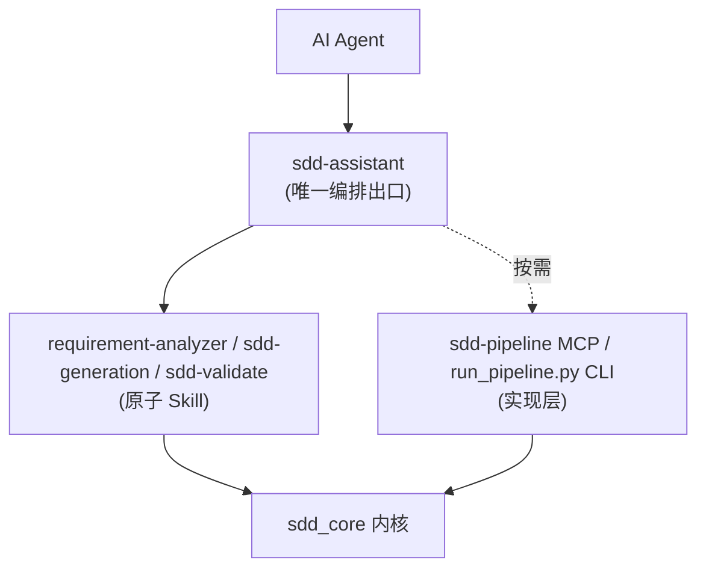

# Agent 接入说明

> 核心原则：**对 Agent 只暴露 `skills/` 这一层**。MCP 与 CLI 属于实现层，仅在原子 Skill 未覆盖时由编排出口按需调用。

## 1. 接入分层



## 2. 接入步骤

1. **加载编排出口**：让 Agent 读取 `skills/sdd-assistant/SKILL.md`，它定义了统一阶段与编排循环。
2. **生成平台配置**（可选）：运行 `python sdd_core/generate_agent_configs.py`，
   为 OpenAI / Claude / Gemini 自动生成 `skills/*/agents/*.yaml`。
   该脚本同时校验每个 Skill 的目录契约（必须包含 `SKILL.md`、`manifest.yaml`、`input.schema.json`、`output.schema.json`）。
3. **驱动流程**：Agent 按统一阶段调用原子 Skill，每步以门控结果决定继续 / 修复 / 升级人工。

## 3. 统一阶段命名词表

| 统一阶段名 | 含义 | 对应 Skill / 实现层入口 |
| :--- | :--- | :--- |
| 分析需求 (analyze) | PRD → 结构化需求 | requirement-analyzer |
| 生成设计 (design) | 需求 → 技术方案 + 设计包 | sdd-generation |
| 设计门控 (design-gate) | Gate 1/2/3 | sdd-validate |
| 生成切片 (slice) | 设计 → 任务切片 | sdd-pipeline（实现层） |
| 实现门控 (impl-gate) | Gate 4/5 | sdd-validate / sdd-pipeline（实现层） |
| 发布门控 (release-gate) | 上线前总检 | sdd-pipeline（实现层） |

## 4. 确定性入口（CI / 非交互）

```powershell
python skills/sdd-assistant/run.py <PRD路径> ./specs/<feature_name> <feature_name> [--strict] [--no-ai]
```

该入口按固定顺序串联 `requirement-analyzer → sdd-generation → sdd-validate`，适合流水线调用。

## 5. 实现层何时直接用

仅当原子 Skill 未覆盖某阶段（如生成切片、实现门控、发布门控、项目级推进）时，
才由编排出口调用 `sdd-pipeline` MCP 或 `sdd_core/run_pipeline.py` CLI。
不要让 Agent 把 MCP/CLI 作为常规入口，以免回到“多入口发散”的状态。
