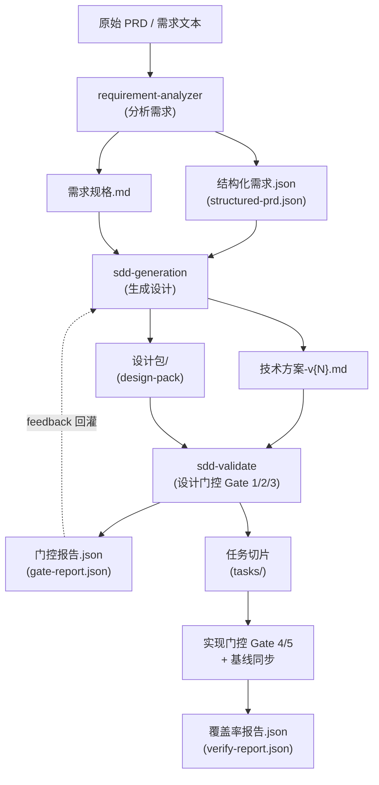

# Skill 数据流协议

> 定义 SDD 各 Skill 之间流转的产物与契约。产物以**中文显示名**为准，物理文件名遵循统一映射
> （单一真相源：`sdd_core/infrastructure/artifact_names.py`）。

## 1. 端到端数据流

## 2. 产物命名映射

| 中文显示名 | 物理文件 / 目录 | 产出 Skill | 说明 |
| :--- | :--- | :--- | :--- |
| `结构化需求.json` | `structured-prd.json` | requirement-analyzer | 机器可读的结构化需求 |
| `需求规格.md` | `需求规格.md` | requirement-analyzer | 人工可读需求规格（前两个 YAML 块为机器契约） |
| `技术方案-v{N}.md` | `技术方案-v{N}.md` | sdd-generation | 主设计文档，显式引用设计包 |
| `设计包` | `design-pack/` | sdd-generation | 按 capability_tags 生成的契约文件集 |
| `门控报告.json` | `gate-report.json` | sdd-validate | 门控结果，可作为 `--feedback` 回灌 |
| `任务列表.json` | `task-slices.generated.json` | sdd-pipeline（实现层） | 机器可读任务清单 |
| `覆盖率报告.json` | `verify-report.json` | 实现门控 | 需求到实现的覆盖率 |
| `审批记录.json` | `approval.json` | 审批流程 | 高风险变更审批留痕 |

> 物理名保持稳定（部分仍为英文）的原因：避免破坏既有读写路径与 JSON Schema `$id`。
> 任何需要展示产物名的代码都应引用 `artifact_names.py`，而不是各自硬编码字符串。

## 3. 阶段间契约要点

- **分析需求 → 生成设计**：`sdd-generation` 优先消费 `结构化需求.json`；缺失时从 `需求规格.md` 推导最小结构。
- **生成设计 → 设计门控**：`技术方案-v{N}.md` 必须显式引用 `设计包`，否则 Gate 1 判失败。
- **设计门控 → 生成设计（修复回灌）**：门控失败时，`门控报告.json` 作为 `--feedback` 输入驱动下一版设计。
- **设计门控 → 实现门控**：仅在设计门控全部通过后进入；实现门控校验任务切片与代码实现的对齐与覆盖率。
