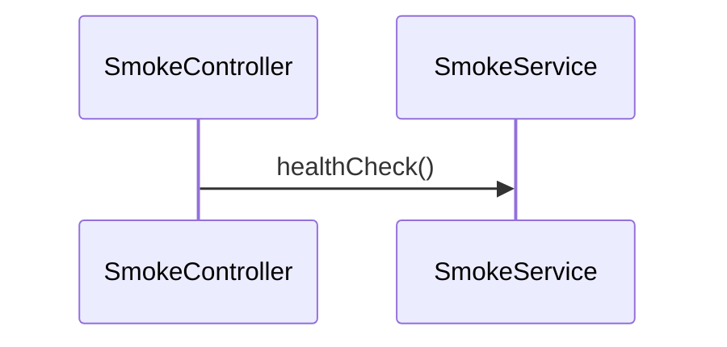

# Lightweight API Smoke Design

## Goal

Provide a tiny built-in feature that can be used for doctor gate smoke checks.

```mermaid
sequenceDiagram
    participant C as SmokeController
    participant S as SmokeService
    C->>S: healthCheck()
```
