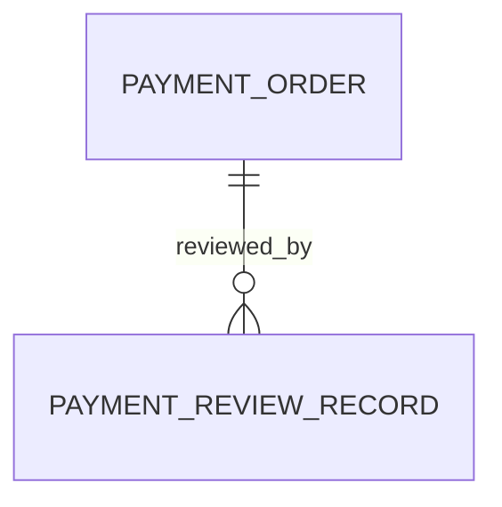
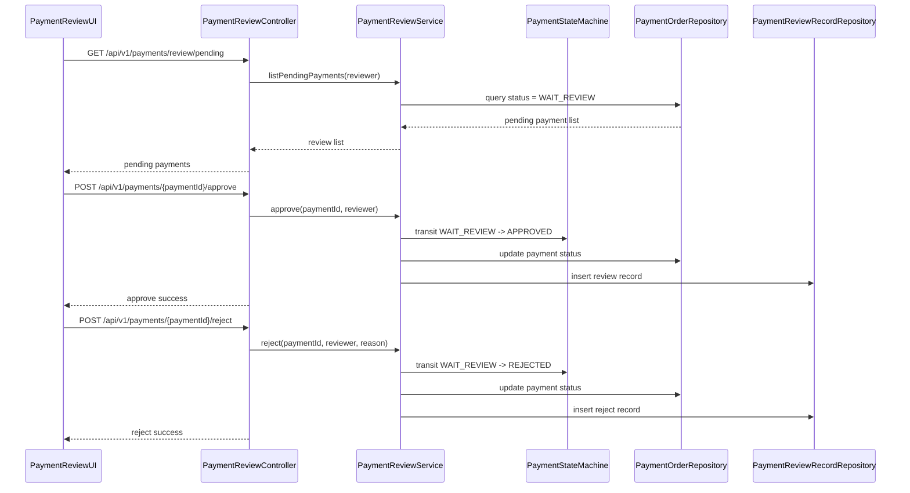

# 技术设计方案：payment-review-control

**版本:** `v1.0`  
**日期:** `2026-04-17`  
**状态:** `Draft | Review | Approved`  
**来源 Feature Brief:** `specs/pilot-payment-review/feature-brief.md`

---

## 1. 设计概述

- 设计目标：实现支付审核列表查询、审核通过与审核驳回流程，并确保支付状态流转受控。
- 适用范围：审核端支付审核列表页、审核通过接口、驳回接口。
- 对应 `REQ-ID`：REQ-001、REQ-002、REQ-003

## 2. 领域模型映射

### 2.1 涉及实体

| 实体 | 说明 | 对应表/对象 | 备注 |
| --- | --- | --- | --- |
| PaymentOrder | 支付单主对象 | t_payment_order | 承载支付状态、审核信息 |
| PaymentReviewRecord | 审核记录对象 | t_payment_review_record | 记录审核动作、审核人、审核结果 |

### 2.2 实体关系图

## 3. 核心流程

### 3.1 主流程序列图

### 3.2 异常流程

| 场景 | 触发条件 | 处理方式 |
| --- | --- | --- |
| 非审核人员访问 | 用户无审核权限 | 返回 403，拒绝访问 |
| 重复审核 | 支付单状态已不是 WAIT_REVIEW | 返回 409，拒绝流转 |
| 驳回原因缺失 | 驳回请求未带原因 | 返回 400，拒绝流转 |

## 4. 接口契约

引用：`design-pack/接口契约.openapi.yaml`

核心接口：

- `GET /api/v1/payments/review/pending`
- `POST /api/v1/payments/{paymentId}/approve`
- `POST /api/v1/payments/{paymentId}/reject`

## 5. 数据库变更

### 5.1 变更概述

- 是否有表结构变更：否（本试点优先复用现有支付单与审核记录结构）
- 是否有索引变更：否
- 是否有数据迁移：否

### 5.2 变更脚本

本试点不涉及数据库变更脚本。

## 6. 异常处理

| 异常场景 | 错误码 | 处理策略 |
| --- | --- | --- |
| 无审核权限 | PAYMENT_NO_REVIEW_PERMISSION | 拒绝访问，返回 403 |
| 非法状态审核 | PAYMENT_INVALID_STATUS | 拒绝流转，返回 409 |
| 重复审核 | PAYMENT_DUPLICATE_REVIEW | 拒绝重复审核，返回 409 |
| 驳回原因缺失 | PAYMENT_REJECT_REASON_REQUIRED | 拒绝驳回，返回 400 |

## 7. 架构约束自查

- [x] 分层调用符合规范
- [x] 事务边界清晰
- [x] 异常处理符合规范
- [x] 接口契约已落盘
- [x] 风险审批需要高风险审批文件

## 8. 验收标准矩阵

| REQ-ID | 需求摘要 | 验收条件（可测量） | 测试类型 | P级 |
| --- | --- | --- | --- | --- |
| REQ-001 | 支付审核列表查询 | 审核人员仅能查询到待审核支付单 | integration | P0 |
| REQ-002 | 审核通过后状态流转 | 审核通过后状态流转为 APPROVED 且不可重复审核 | integration | P0 |
| REQ-003 | 审核驳回后状态流转 | 审核驳回后状态流转为 REJECTED 且记录驳回原因 | integration | P0 |

## 9. 设计包引用

- `design-pack/接口契约.openapi.yaml`
- `design-pack/接口文档.md`
- `design-pack/支付状态机.md`
- `design-pack/对账策略.md`
- `design-pack/幂等策略.md`
