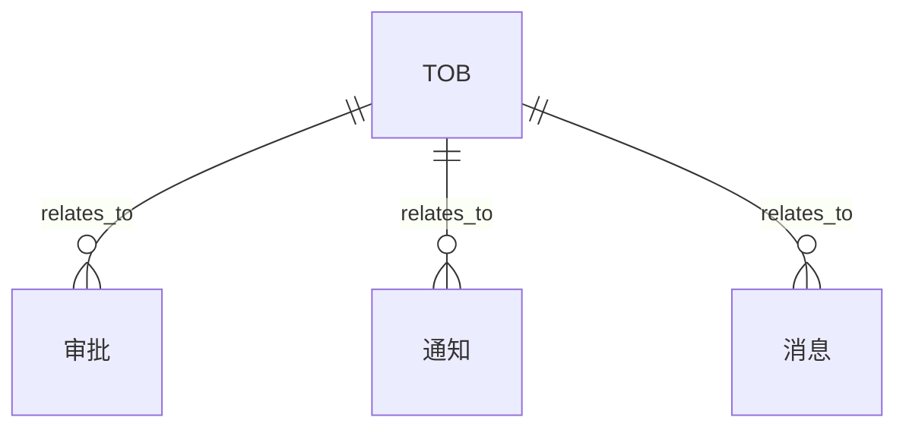
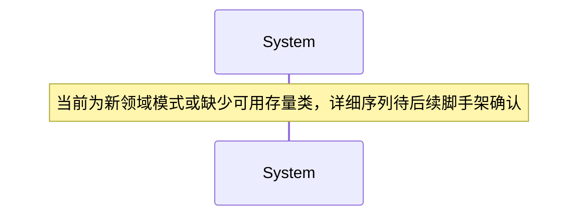

# 技术设计方案：tob-oa-office-demo

**版本:** `v5.0`  
**日期:** `2026-05-07`  
**状态:** `Draft`  
**来源 Feature Brief:** `specs/tob-oa-office-demo/feature-brief.md`

---

## 1. 设计概述

- 设计目标：人事：员工档案、组织架构
- 适用范围：覆盖当前 Feature 的主流程、异常处理和设计包约束。
- 对应 `REQ-ID`：REQ-001、REQ-002、REQ-003、REQ-004、REQ-005
- 事务边界：主流程写操作、状态切换与关键记录写入放在同一事务边界内。
- 设计场景：`brownfield` / `project_mode=hybrid`

- 历史修复约束：
- [gate2] 未从设计文档中提取到 Mermaid participant 或 classDiagram 类名 -> 修复建议：根据反馈修复对应章节或设计包内容

## 2. 领域模型映射

### 2.1 涉及实体

| 实体 | 说明 | 对应表/对象 | 备注 |
| --- | --- | --- | --- |
| ToB | ToB 相关领域对象 | PENDING_TABLE_TOB | 新领域模式/待确认 |
| 审批 | 审批 相关领域对象 | PENDING_TABLE_TOB_OA_OFFICE_DEMO | 新领域模式/待确认 |
| 通知 | 通知 相关领域对象 | PENDING_TABLE_TOB_OA_OFFICE_DEMO | 新领域模式/待确认 |
| 消息 | 消息 相关领域对象 | PENDING_TABLE_TOB | 新领域模式/待确认 |

### 2.2 实体关系图

## 3. 核心流程

### 3.1 主流程序列图

### 3.2 异常流程

| 场景 | 触发条件 | 处理方式 |
| --- | --- | --- |
| 参数不合法 | 请求缺字段或字段非法 | 返回 400 并终止处理 |
| 状态冲突 | 请求与当前业务状态不一致 | 返回 409，避免重复流转 |
| 依赖异常 | 外部系统、数据库或关键依赖异常 | 记录错误并按策略重试/告警 |

## 4. 接口契约

引用：`design-pack/接口契约.openapi.yaml`

核心接口：

- `GET /api/v1/hr/employees`
- `POST /api/v1/hr/employees`
- `GET /api/v1/hr/org-tree`
- `GET /api/v1/approvals`
- `POST /api/v1/approvals/leave`
- `POST /api/v1/approvals/overtime`
- `POST /api/v1/approvals/reimburse`
- `POST /api/v1/approvals/process-definitions`
- `GET /api/v1/notices`
- `POST /api/v1/notices`
- `POST /api/v1/messages/push`
- `GET /api/v1/attendance/records`

## 5. 数据库变更

### 5.1 变更概述

- 是否有表结构变更：是
- 是否有索引变更：是
- 是否有数据迁移：视存量数据情况评估

### 5.2 变更脚本

引用：`design-pack/数据库变更.sql`

## 6. 异常处理

| 异常场景 | 错误码 | 处理策略 |
| --- | --- | --- |
| 参数不合法 | 400 | 返回业务错误并提示修正输入 |
| 状态冲突或重复提交 | 409 | 拒绝重复执行并返回当前状态 |

## 7. 架构约束自查

- [x] 分层调用符合规范
- [x] 事务边界清晰
- [x] 异常处理符合规范
- [x] 接口契约已落盘
- [x] 数据库变更有回滚

## 8. 验收标准矩阵

| REQ-ID | 需求摘要 | 验收条件（可测量） | 测试类型 | P级 |
| --- | --- | --- | --- | --- |
| REQ-001 | 人事 | 人事 可通过接口或集成测试验证 | integration | P0 |
| REQ-002 | 审批 | 审批 可通过接口或集成测试验证 | integration | P1 |
| REQ-003 | 公告通知、消息推送 | 公告通知、消息推送 可通过接口或集成测试验证 | integration | P1 |
| REQ-004 | 日程考勤、打卡签到 | 日程考勤、打卡签到 可通过接口或集成测试验证 | integration | P1 |
| REQ-005 | 文件网盘、在线预览 | 文件网盘、在线预览 可通过接口或集成测试验证 | integration | P1 |
| REQ-006 | 面向 ToB 企业客户 | 面向 ToB 企业客户 可通过接口或集成测试验证 | integration | P1 |
| REQ-007 | 审批流程需要具备一定可配置性 | 审批流程需要具备一定可配置性 可通过接口或集成测试验证 | integration | P1 |
| REQ-008 | 文件能力至少支持上传、下载与常见办公文件在线预览 | 文件能力至少支持上传、下载与常见办公文件在线预览 可通过接口或集成测试验证 | integration | P1 |

## 9. 设计包引用

- `design-pack/接口契约.openapi.yaml`
- `design-pack/接口文档.md`
- `design-pack/异步事件契约.yaml`
- `design-pack/数据模型.md`
- `design-pack/数据库变更.sql`
